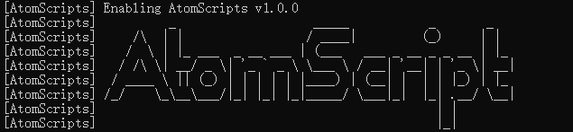
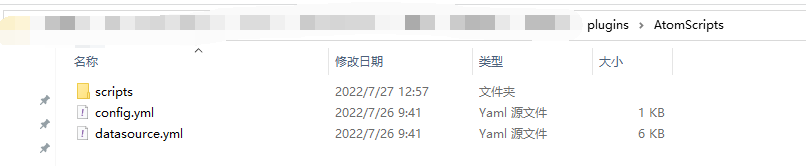
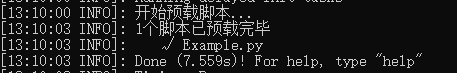
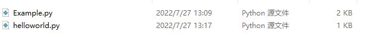
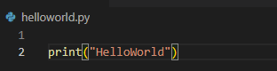
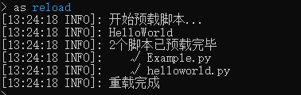
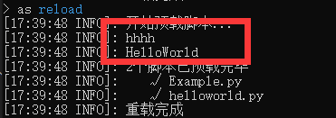
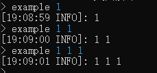

# 下载与安装

---

前往MCBBS下载

[地址] (https://www.mcbbs.net/thread-1366839-1-1.html)

插件无任何硬性前置，TabooLib会在第一次运行时热加载

下载完毕后，直接放入服务端的插件文件夹下

重启服务器或使用类似YUM的插件直接Load

重启后

到这里如果没有报错的话插件正常加载了

服务端内插件文件如下

接下来插件会尝试预载服务端/plugins/AtomScripts/scripts/ 内的所有脚本

插件内置的示例脚本Example已被预载

!> 预载意味着脚本文件内除函数体之外的内容都会被运行一次

这可能会消耗一些时间，但预载之后的脚本执行时将会在JVM中直接运行

!> means 执行时速度极快

---

### 第一个脚本HelloWorld

在/plugins/AtomScripts/scripts/ 下新建一个文件 helloworld.py

使用任何文本编辑器或者IDE打开，vscode、notepad、vim 甚至记事本

添加一行代码 print("HelloWorld") 并保存

服务器内输入命令 as reload 重新预载所有脚本

可以看到新建的helloworld.py已经被预载

前面提到过预载时会执行除函数体以外的所有代码

所以我们写入的那一行print("HelloWorld")已经被执行

---

### 通用设置

以下设置 在脚本的函数体外 随意放置

!> 如果你想在脚本中使用中文,encoding和import unicode这两行
一定要到脚本最前面去

    #encoding:utf-8
    #请永远保持下面这行import处于第一行
    #否则中文乱码
    from __future__ import unicode_literals

    #以下所有设置不需要的话可以省略
    # 脚本名
    scriptName = "Example"
    # 显示名
    displayName = "示例"
    # 作者
    authors = ["atom"]
    # 版本
    version = "1.0.0"
    # 加载后自动开启
    autoEnable = False

AtomScript使用kotlin作为自身开发语言，所有空安全很到位

以上的设置如果觉得不必要可以直接不写，不会报错

在不填写scriptName的情况下，脚本的显示名将会默认采用文件名

比较需要注意的是autoEnable这个键，如果开启

脚本预载时除了函数体外的代码运行，onEnable这个函数也会被运行，充当程序入口

同时还有onDisable

没有设置自动开启的话，可以在任意时间使用指令

    /as enable 脚本名

输入到/as enable 时按Tab 会出现补全提示，待选项包括所有已预载的脚本

想要关闭就disable，关闭后脚本内注册的命令将会被取消

---

### 混合语法

介绍已经提到，AtomScript采用Jython作为Java与python沟通的桥梁

那么我们可以在脚本内任意使用两者的原生语法

可能你已经注意到了，在HelloWorld中我们使用的print()就是python的原生方法

!> 需要特别说明的一点是，虽然在脚本内我们有时使用python
但在预载时，整个脚本会被Jython加载进Java VM
在JVM中作为被翻译过的Java语句存在
换句话来说就是，不卡

下面是关于混合语法的用例

    #直接像这样调用java语句是肯定不行的会报错，除非是注入的类对象
    System.out.printf("hhhh\n")
    print("HelloWorld")

在脚本文件的上方加上

    from java.lang import System

效果如下

!> 具体Java语句的包名请查看  [JavaDoc](https://docs.oracle.com/en/java/javase/17/docs/api/index.html)

---

### 命令注册

在脚本的函数体外，任意位置定义一个map名为commandRegister

name 命令名

alias 别名，比如定义了ex。那么既可以用/example触发命令，也可以用/ex

注意alias是一个列表，可以填很多个，但是尽量不要和别的插件指令名冲突了

description是命令描述，暂时还没什么勾八用

handlerFunction很重要，命令被触发后会在文件内搜索同名函数执行
Click to copy
    commandRegister = {
        #主命令 直接/example时无参数就执行handlerFunction
        "mainCommand" : {
            "name": "example",
            "alias": ["ex","examplemain"],
            "description": "just a example script",
            "handlerFunction": "mainCommandExample"
        }
    }
 

定义完commandRegister后，在文件内任意位置定义一个函数，函数名要跟handlerFunction的值相同

    def mainCommandExample():

!> 在这个函数体内你可以直接使用两个变量，无需申明

!> 变量是被注入的，分别为sender与argument

sender是执行命令的对象，类型为玩家或服务器

argument是命令参数，可变长度的列表

/example 1 2 3  这里的argument就是["1","2","3"]

假设我想实现一个功能，当玩家使用/example xxx时

给玩家发送信息xxx

同时想执行这个指令需要权限example.say

    def mainCommandExample():
        if(sender.hasPermission("example.say")):
            sender.sendMessage(argument)

!> 关于sender的内容可查看文档，[CommandSender](/course/taboo/CommandSender)

---

### 事件监听

    #encoding:utf-8
    #请永远保持下面这行import处于第一行
    #否则中文乱码
    from __future__ import unicode_literals

    #注册事件监听器需要引入几个包

    #https://bukkit.windit.net/javadoc/org/bukkit/event/package-summary.html
    #链接内有bukkit所有的事件
    from org.bukkit.event.player import PlayerJoinEvent

    #细心的朋友可能发现了，通过这个方式可以使用服务器所有插件的包
    import indi.atom.taboolib.common.platform.function.ListenerKt as ListenerKt
    import indi.atom.taboolib.common.platform.event.EventPriority as EventPriority

    autoEnable = True

    #储存所有监听器的地方，不要删
    listeners = []

    #注册事件监听器需要在onEnable内
    def onEnable():
        print("hhh")
        #第一个参数: 任意的BukkitEvent 比如org.bukkit.event.player.PlayerJpoinEvent
        #第二个参数: 优先级 LOWEST(-64), LOW(-32), NORMAL(0), HIGH(32), HIGHEST(64), MONITOR(128)
        #True或者false 当其他插件关闭了所注册监听的事件时，自身是否仍要收到事件
        #回调函数
        ListenerKt.registerBukkitListener(PlayerJoinEvent,EventPriority.NORMAL,True,onPlayerJoin)

    #接收到两个变量 listener和event
    #listener在脚本关闭时要用来卸载监听
    #event 具体查看事件的文档链接
    def onPlayerJoin(listen,event):
        #下面这句把监听器加进listeners列表，必不可少！！！
        listeners.append(listen)
        event.getPlayer().sendMessage("11111")

    #在disable内设置卸载监听!!!很重要
    def onDisable():
        #循环关闭所有监听器，必不可少！！！
        for i in listeners:
            i.close()
        print("disable")
    
